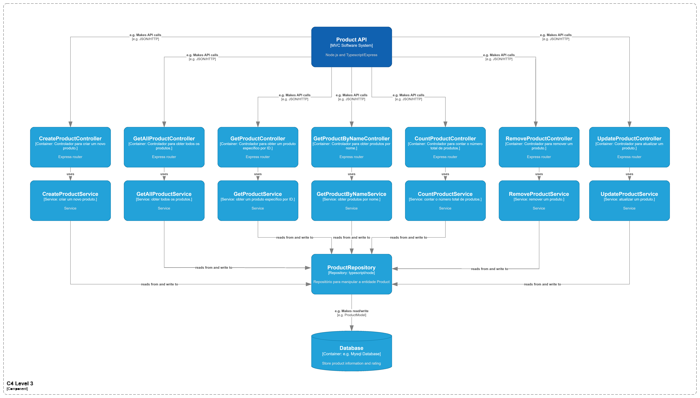

# Desafio final XP - Arquiteto de software

## Visão Geral

Este é um sistema de gerenciamento de produtos desenvolvido com Node.js e TypeScript, construído para fins acadêmicos, seguindo os princípios do MVC, conforme requisitado para o desafio.

## Estrutura do Projeto

```
src
├───config
├───controllers
│ └───products
├───core
├───helpers
├───models
│ ├───dto
│ ├───entities
│ │ ├───erros
│ │ └───sequelize
│ ├───repositories
│ └───storage
├───routes
└───services
└───Product
```

## Tecnologias utilizadas

- **Node.js**
- **Typescript**
- **Express**
- **Sequelize**
- **sqlite3**

## Configuração e Execução

### Pré-requisitos

Certifique-se de ter os seguintes softwares instalados em sua máquina:

- [Node.js](https://nodejs.org/) (versão 14 ou superior)
- [npm](https://www.npmjs.com/) (gerenciador de pacotes do Node.js)

### Passos para Configuração

1. **Clone o repositório:**
   ```bash
   git clone https://github.com/eriick505/desafio-final-arquiteto-software-xp-educacao
   cd desafio-final-arquiteto-software-xp-educacao
   ```
2. **Instale as dependencias:**

```bash
 npm install
```

2. **Execute a aplicação:**

```bash
 npm run start:dev
```

## Entidades


## Métodos Implementados

- **POST /products**: Cria um novo produto.
- **GET /products**: Retorna todos os produtos.
- **GET /products/{id}**: Retorna um produto específico pelo ID.
- **PATCH /products/{id}**: Atualiza um produto específico pelo ID.
- **DELETE /products/{id}**: Exclui um produto específico pelo ID.
- **GET /products/count**: Retorna o número total de produtos.
- **GET /products/name/{name}**: Retorna um produtos específico pelo nome

## C4 Model




